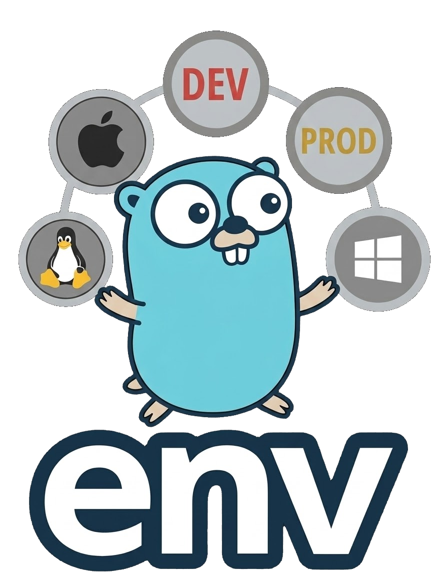

<p align="center">
  
</p>

<p align="center">
    Typed environment variables for Go – safe defaults, app env helpers, and zero-ceremony configuration.
</p>

<p align="center">
    <a href="https://pkg.go.dev/github.com/goforj/env"></a>
    <a href="LICENSE"></a>
    <a href="https://github.com/goforj/env/actions"></a>
    <a href="https://golang.org"></a>
    
    <a href="https://codecov.io/gh/goforj/env" ></a>
    <a href="https://goreportcard.com/report/github.com/goforj/env"></a>
</p>

<p align="center">
  <code>env</code> provides strongly-typed access to environment variables with predictable fallbacks.  
  Eliminate string parsing, centralize app environment checks, and keep configuration boring.  
  Designed to feel native to Go - and invisible when things are working.
</p>

# Features

- 🔐 **Strongly typed getters** – `int`, `bool`, `float`, `duration`, slices, maps
- 🧯 **Safe fallbacks** – never panic, never accidentally empty
- 🌎 **Application environment helpers** – `dev`, `local`, `prod`
- 🧩 **Zero dependencies** – pure Go, lightweight
- 🧭 **Framework-agnostic** – works with any Go app
- 📐 **Enum validation** – constrain values with allowed sets
- 🧼 **Predictable behavior** – no magic, no global state surprises
- 🧱 **Composable building block** – ideal for config structs and startup wiring

## Why env?

Accessing environment variables in Go often leads to:

- Repeated parsing logic
- Unsafe string conversions
- Inconsistent defaults
- Scattered app environment checks

**env** solves this by providing **typed accessors with fallbacks**, so configuration stays boring and predictable.

## Features

- Strongly typed getters (`int`, `bool`, `duration`, slices, maps)
- Safe fallbacks (never panic, never empty by accident)
- App environment helpers (`dev`, `local`, `prod`)
- Zero dependencies
- Framework-agnostic

## Installation

```bash
go get github.com/goforj/env
````

## Usage

```go
import "github.com/goforj/env"

port := env.GetInt("PORT", 8080)
debug := env.GetBool("DEBUG", false)
timeout := env.GetDuration("REQUEST_TIMEOUT", time.Second*5)
```

### Environment file loading

This package uses `github.com/joho/godotenv` for `.env` file loading.
It is intentionally composed into the runtime detection and APP_ENV model rather than reimplemented.

### Application environment

```go
if env.IsAppEnvDev() {
    // dev-only behavior
}
```

<!-- api:embed:start -->

### Index

| Group | Functions |
|------:|-----------|
| **Other** | [Arch](#arch) [Get](#get) [GetAppEnv](#getappenv) [GetBool](#getbool) [GetDuration](#getduration) [GetEnum](#getenum) [GetFloat](#getfloat) [GetInt](#getint) [GetInt64](#getint64) [GetMap](#getmap) [GetSlice](#getslice) [GetUint](#getuint) [GetUint64](#getuint64) [IsAppEnv](#isappenv) [IsAppEnvDev](#isappenvdev) [IsAppEnvLocal](#isappenvlocal) [IsAppEnvLocalOrStaging](#isappenvlocalorstaging) [IsAppEnvProduction](#isappenvproduction) [IsAppEnvStaging](#isappenvstaging) [IsAppEnvTesting](#isappenvtesting) [IsAppEnvTestingOrLocal](#isappenvtestingorlocal) [IsBSD](#isbsd) [IsContainer](#iscontainer) [IsContainerOS](#iscontaineros) [IsDocker](#isdocker) [IsDockerHost](#isdockerhost) [IsDockerInDocker](#isdockerindocker) [IsEnvLoaded](#isenvloaded) [IsHostEnvironment](#ishostenvironment) [IsKubernetes](#iskubernetes) [IsLinux](#islinux) [IsMac](#ismac) [IsUnix](#isunix) [IsWindows](#iswindows) [LoadEnvFileIfExists](#loadenvfileifexists) [MustGet](#mustget) [MustGetBool](#mustgetbool) [MustGetInt](#mustgetint) [OS](#os) |


## Other

### <a id="arch"></a>Arch

Arch returns the CPU architecture the binary is running on.

This corresponds to runtime.GOARCH and may be:

- "amd64"
- "arm64"
- "386"
- "arm"
- etc.

```go
fmt.Println(env.Arch()) // prints: arm64
```

### <a id="get"></a>Get

Get returns the environment variable for the given key,
or the provided fallback if empty.

```go
dbHost := env.Get("DB_HOST", "localhost")
```

### <a id="getappenv"></a>GetAppEnv

GetAppEnv returns the current APP_ENV

### <a id="getbool"></a>GetBool

GetBool parses a boolean from an environment variable.

Accepted values: true/false, 1/0, t/f, TRUE/FALSE.

```go
debug := env.GetBool("DEBUG", "false")
```

### <a id="getduration"></a>GetDuration

GetDuration parses a Go duration string (e.g. "5s", "10m", "1h").

```go
timeout := env.GetDuration("HTTP_TIMEOUT", "5s")
```

### <a id="getenum"></a>GetEnum

GetEnum ensures the environment variable's value is in the allowed list.

```go
env := env.GetEnum("APP_ENV", "dev", []string{"dev","staging","prod"})
```

### <a id="getfloat"></a>GetFloat

GetFloat parses a float64 from an environment variable.

```go
threshold := env.GetFloat("THRESHOLD", "0.75")
```

### <a id="getint"></a>GetInt

GetInt parses an int from an environment variable with a fallback.

```go
port := env.GetInt("PORT", "8080")
```

### <a id="getint64"></a>GetInt64

GetInt64 parses an int64 from an environment variable.

```go
size := env.GetInt64("MAX_SIZE", "1024")
```

### <a id="getmap"></a>GetMap

GetMap parses key=value pairs separated by commas.

```go
limits := env.GetMap("LIMITS", "read=10,write=5")
// → map[string]string{"read":"10", "write":"5"}
```

### <a id="getslice"></a>GetSlice

GetSlice splits a comma-separated string into a []string.

```go
peers := env.GetSlice("PEERS", "10.0.0.1,10.0.0.2")
// → []string{"10.0.0.1", "10.0.0.2"}
```

### <a id="getuint"></a>GetUint

GetUint parses an unsigned int from environment variables.

```go
workers := env.GetUint("WORKERS", "4")
```

### <a id="getuint64"></a>GetUint64

GetUint64 parses an unsigned 64-bit int from environment variables.

```go
maxItems := env.GetUint64("MAX_ITEMS", "5000")
```

### <a id="isappenv"></a>IsAppEnv

IsAppEnv checks if the current APP_ENV matches any of the provided environments

### <a id="isappenvdev"></a>IsAppEnvDev

IsAppEnvDev checks if the current APP_ENV is dev

### <a id="isappenvlocal"></a>IsAppEnvLocal

IsAppEnvLocal checks if the current APP_ENV is local

### <a id="isappenvlocalorstaging"></a>IsAppEnvLocalOrStaging

IsAppEnvLocalOrStaging checks if the current APP_ENV is local or staging

### <a id="isappenvproduction"></a>IsAppEnvProduction

IsAppEnvProduction checks if the current APP_ENV is production

### <a id="isappenvstaging"></a>IsAppEnvStaging

IsAppEnvStaging checks if the current APP_ENV is staging

### <a id="isappenvtesting"></a>IsAppEnvTesting

IsAppEnvTesting checks if the current APP_ENV is testing or if we're inside running a test

### <a id="isappenvtestingorlocal"></a>IsAppEnvTestingOrLocal

IsAppEnvTestingOrLocal checks if the current APP_ENV is testing or local

### <a id="isbsd"></a>IsBSD

IsBSD reports whether the runtime OS is any BSD variant.

BSD identifiers include:
- "freebsd"
- "openbsd"
- "netbsd"
- "dragonfly"

```go
if env.IsBSD() {
    fmt.Println("Running on a BSD system")
}
```

### <a id="iscontainer"></a>IsContainer

IsContainer detects any container runtime.

### <a id="iscontaineros"></a>IsContainerOS

IsContainerOS reports whether this OS is *typically* used as a container base.

This does NOT indicate whether you are *inside* a container -
only that this OS is the kind most often found in container images.

Currently returns true for Linux.

```go
if env.IsContainerOS() {
    fmt.Println("Likely running in a Docker-optimized OS image")
}
```

### <a id="isdocker"></a>IsDocker

IsDocker reports whether the current process is running in a Docker container.

### <a id="isdockerhost"></a>IsDockerHost

IsDockerHost reports whether this container behaves like a Docker host.

### <a id="isdockerindocker"></a>IsDockerInDocker

IsDockerInDocker reports whether we are inside a Docker-in-Docker environment.

### <a id="isenvloaded"></a>IsEnvLoaded

IsEnvLoaded checks if the environment file has been loaded

### <a id="ishostenvironment"></a>IsHostEnvironment

IsHostEnvironment reports whether the process is running *outside* any
container or orchestrated runtime.

Being a Docker host does NOT count as being in a container.

### <a id="iskubernetes"></a>IsKubernetes

IsKubernetes reports whether running inside Kubernetes.

### <a id="islinux"></a>IsLinux

IsLinux reports whether the runtime OS is Linux.

```go
if env.IsLinux() {
    fmt.Println("Running on Linux")
}
```

### <a id="ismac"></a>IsMac

IsMac reports whether the runtime OS is macOS (Darwin).

```go
if env.IsMac() {
    fmt.Println("Running on macOS")
}
```

### <a id="isunix"></a>IsUnix

IsUnix reports whether the OS is Unix-like.

This returns true for:
- Linux
- macOS (Darwin)
- BSD variants
- Solaris, AIX

```go
if env.IsUnix() {
    fmt.Println("POSIX-compliant system detected")
}
```

### <a id="iswindows"></a>IsWindows

IsWindows reports whether the runtime OS is Windows.

```go
if env.IsWindows() {
    fmt.Println("Running on Windows")
}
```

### <a id="loadenvfileifexists"></a>LoadEnvFileIfExists

LoadEnvFileIfExists loads environment file .env locally
loads .env.testing if invoked from the context of a test file
loads .env.host if invoked from the context of MacOS which references variables to communicate back to the docker network

### <a id="mustget"></a>MustGet

MustGet returns the value of key or panics if missing.

```go
secret := env.MustGet("API_SECRET")
```

### <a id="mustgetbool"></a>MustGetBool

MustGetBool panics if missing or invalid.

```go
enabled := env.MustGetBool("FEATURE_ENABLED")
```

### <a id="mustgetint"></a>MustGetInt

MustGetInt panics if the value is missing or not an int.

```go
port := env.MustGetInt("PORT")
```

### <a id="os"></a>OS

OS returns the current operating system identifier.

This corresponds to runtime.GOOS and will be one of:

- "linux"
- "darwin"
- "windows"
- "freebsd", "openbsd", "netbsd", "dragonfly"
- "solaris", "aix", etc.

```go
fmt.Println(env.OS()) // prints: linux
```
<!-- api:embed:end -->

## Philosophy

**env** is part of the **GoForj toolchain** - a collection of focused, composable packages designed to make building Go applications *satisfying*.

No magic. No globals. No surprises.

## License

MIT
